<p align="center">
  <a href="" rel="noopener">
 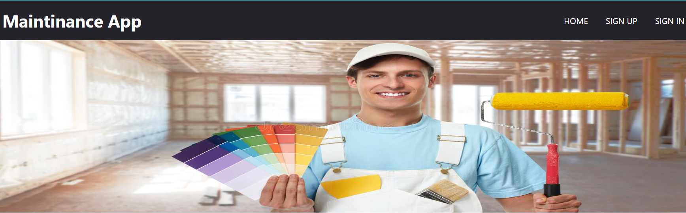
 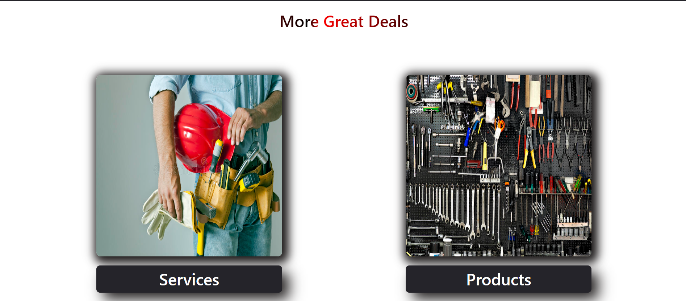
 
 </a>
 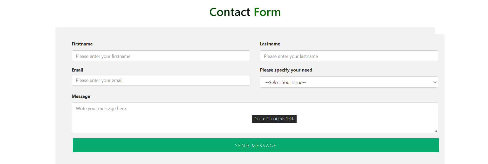
 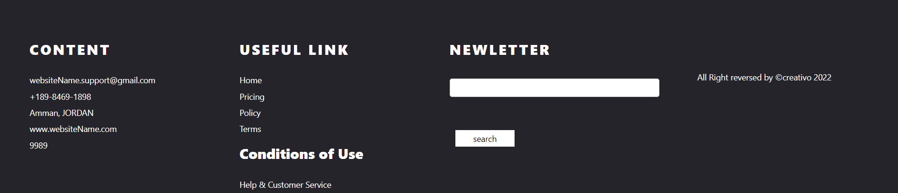
</p>

<h3 align="center">Maintenance App</h3>

---

<p align="center"> An awesome Project to descripe README 
    <br> 
<a href=''>Demo</a>
    <br> 
</p>

## 📝 Table of Contents

- [About](#about)
- [Getting Started](#getting_started)
- [Usage](#usage)
- [Built Using](#built_using)
- [User Story](#user_story)
- [Data Flow](#data_flow)
- [Guided By](#guided_by)

## 🧐 About <a name = "about"></a>

Maintenance App makes it easy to find the items related to maininance in all its froms and also provides the service of having a professional workers in maintaning a specific type of maintenance. By using the Maintinance App website, you can access many maintenace items and workers, where we help you to search for the new item, add them to the shopping cart and buy the new items ypu need.

## 🏁 Getting Started <a name = "getting_started"></a>

These instructions will get you a copy of the project up and running on your local machine for development and testing purposes.

### Prerequisites

- Visual Studio Code follow this <a href='https://code.visualstudio.com/'>link</a> to install.
- Git Bash follow this <a href='https://git-scm.com/downloads'>link</a> to install.
- ElephantSQL follow this <a href='https://customer.elephantsql.com/login'>link</a> to install.
- Node.js follow this <a href='https://nodejs.org/en/'>link</a> to install.
- React.js follow this <a href='https://https://reactjs.org/'>link</a> to install.
- Redux follow this [ intsall by nodemon ] ( npm i react-redux ) to install.

### Installing:

1. Clone the repo to your local machine using git bash.

```
git clone https://github.com/The-Unbeatables/MERAKI_Academy_Project_5
```

2. Install packeges repeat this step in backend and frontend folder

```
npm i
```

3. Run server using git bash inside backend folder

```
npm run dev
```

4. Run application using git bash inside frontend folder

```
npm run start
```

Now app ready to use

## 🎈 Usage <a name="usage"></a>

- You can browser our site without having to register on the site

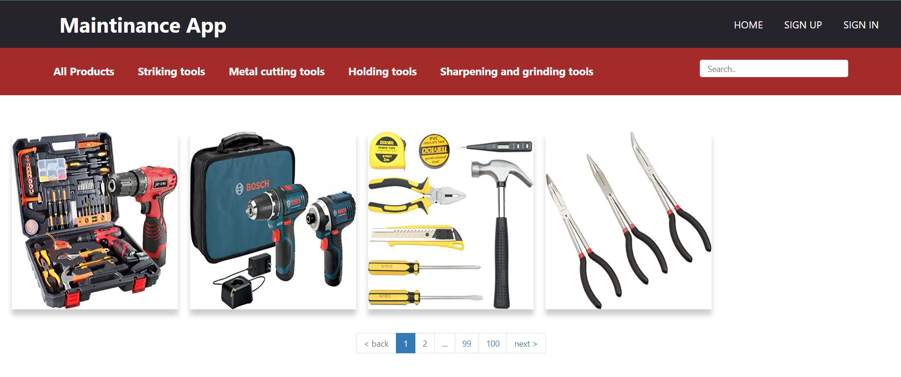
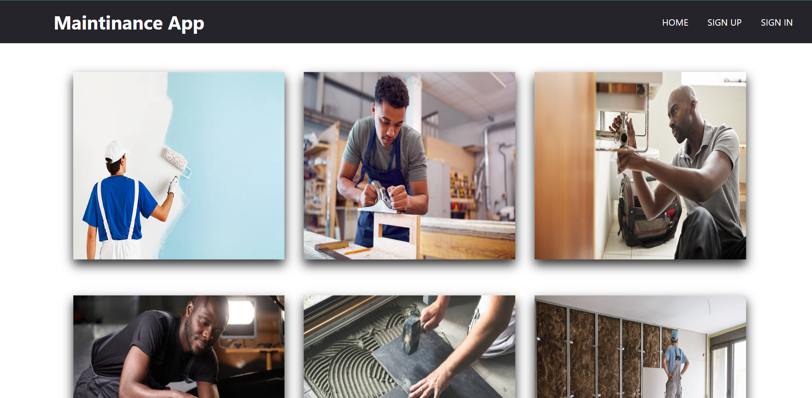

- You can click on the **Home** tab provided in the navigation bar to view the home section

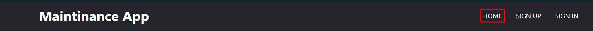

- You can see every single product in the app

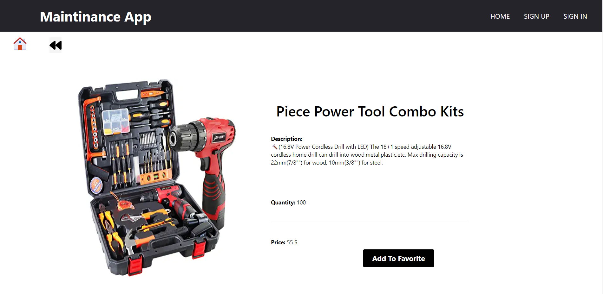

- You cannot add the product to wishlist and cart until after registration

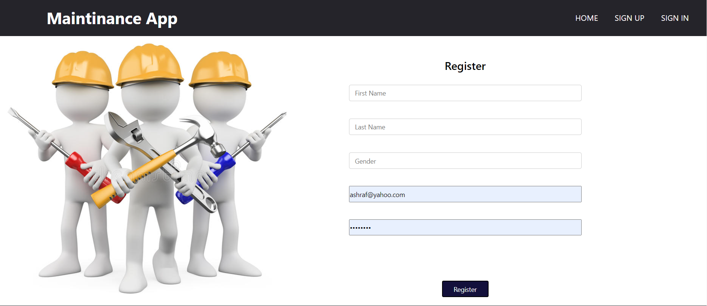

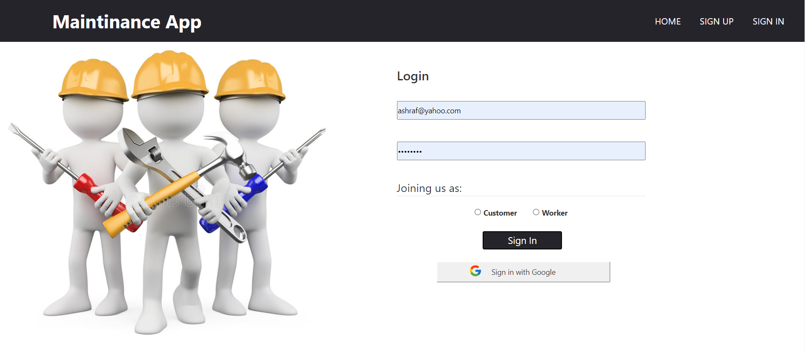

- You can click on the **Add to wishlist** button to add this product to your whislist but you have to be one of our users, so you should create an account.

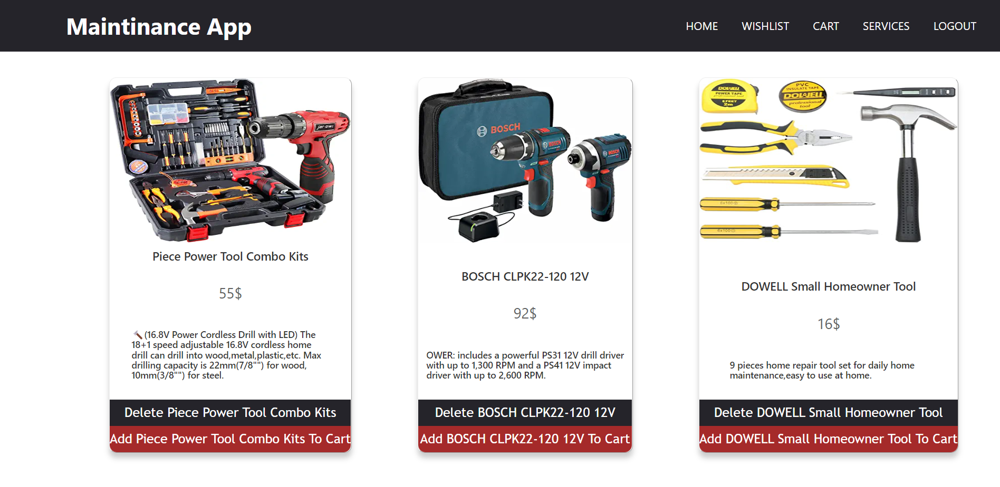

- You can click on the **Add to cart** button to add this product to your cart but you have to be one of our users, so you should create an account

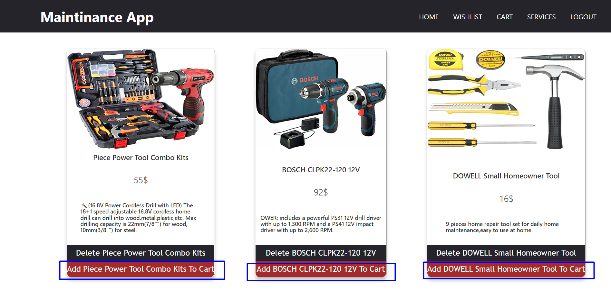

- In product section or page you can filter products bt categories


- In product section you can click on more detailes to view more detailes about the product

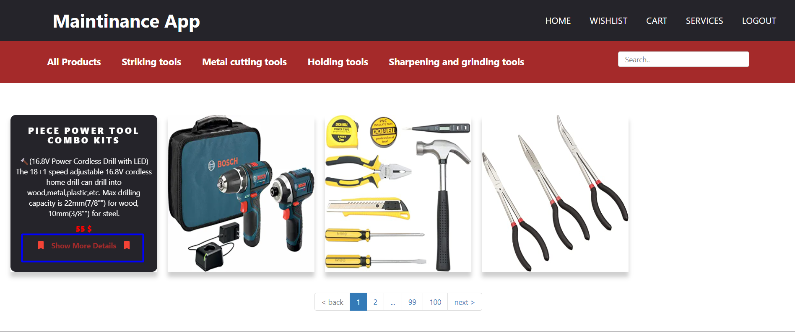

- In wislist section you will see your products that you added you will see remove button and you can remove any product from wishlist


- In cart section you will see your products that you added you will see remove button from cart

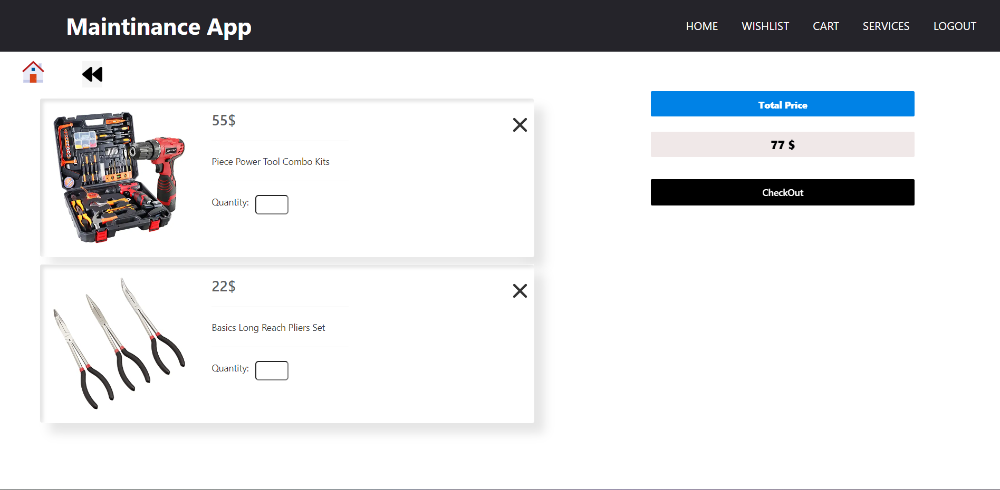

- When ckick on a checkout button you will be asked for a set of information to complete the purchase process from the site

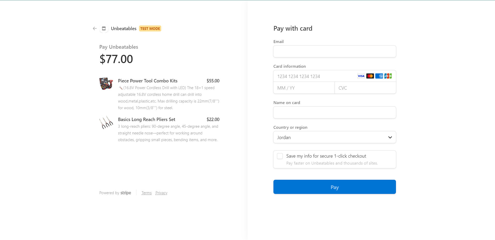

- The user can communicate with the worker within the site and send the request he needs, and await a response from the worker

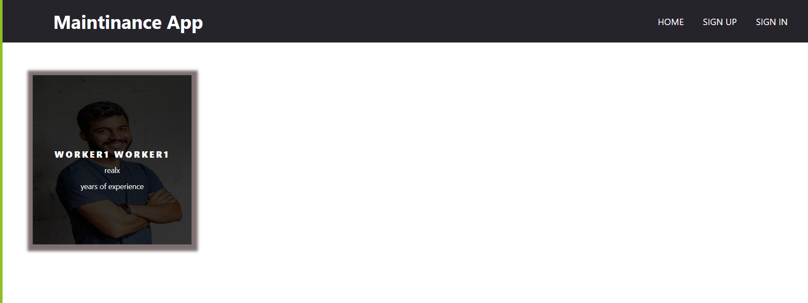

- The admin can add a new product, modify product, show orders and some information about users and site

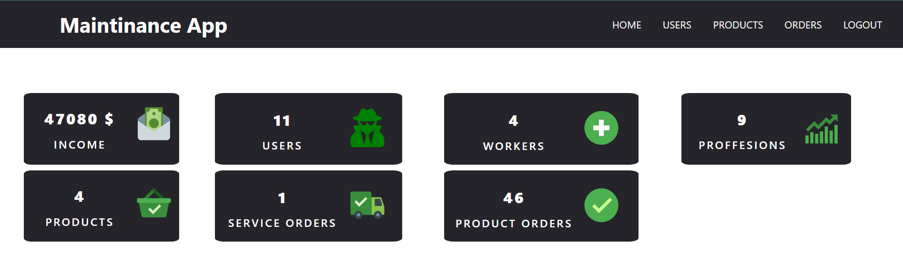
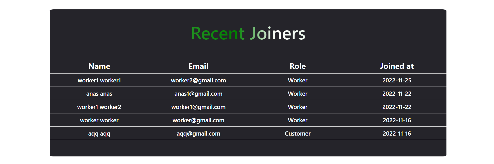
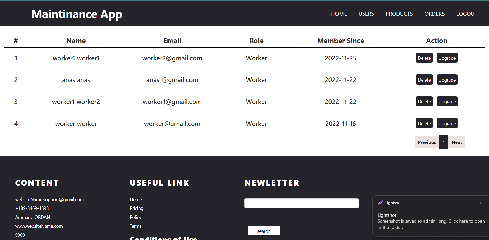
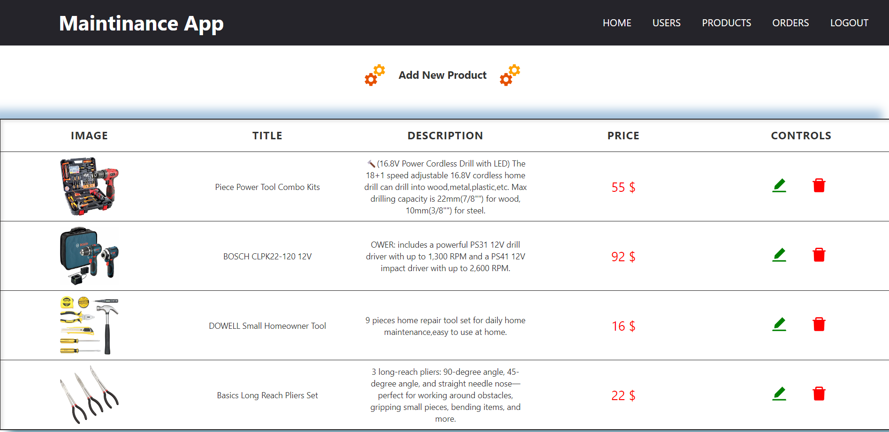
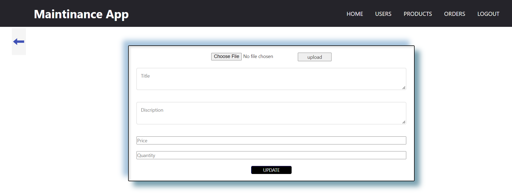
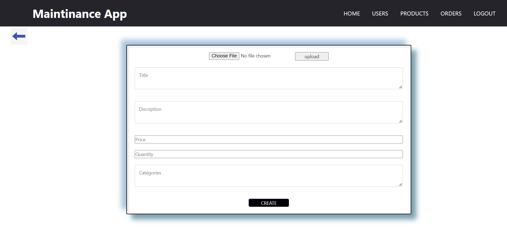
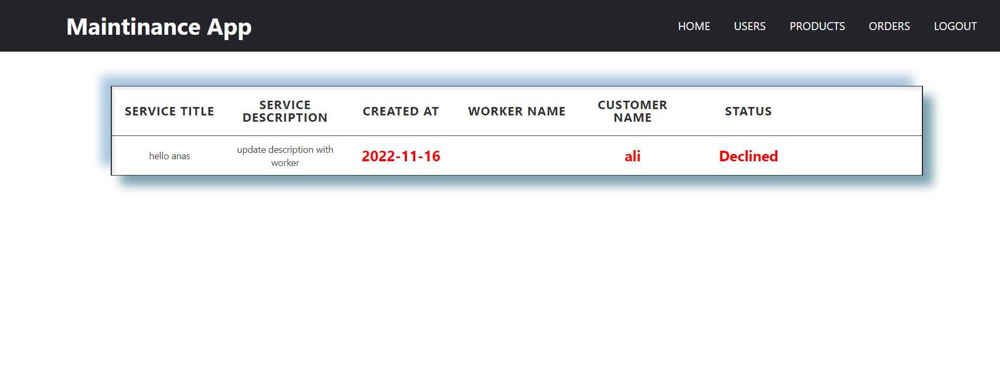

## ⛏️ Built Using <a name = "built_using"></a>

- [ElephantSQL](https://customer.elephantsql.com/login) - Database
- [Express JS](https://expressjs.com/) - Server Framework
- [React JS](https://https://reactjs.org/) - Web Framework
- [Node JS](https://nodejs.org/en/) - Server Environment

## User Story <a name = "#user_story"></a>

Your trello board link
<a href='https://trello.com/b/LaLHPwvo/project-5'>Trello</a>

## Data Flow <a name = "#data_flow"></a>

</a>

## ⚠️ Guided By <a name = "guided_by"></a>

This project is guided by ©️ **[MERAKI Academy](https://www.meraki-academy.org)**
